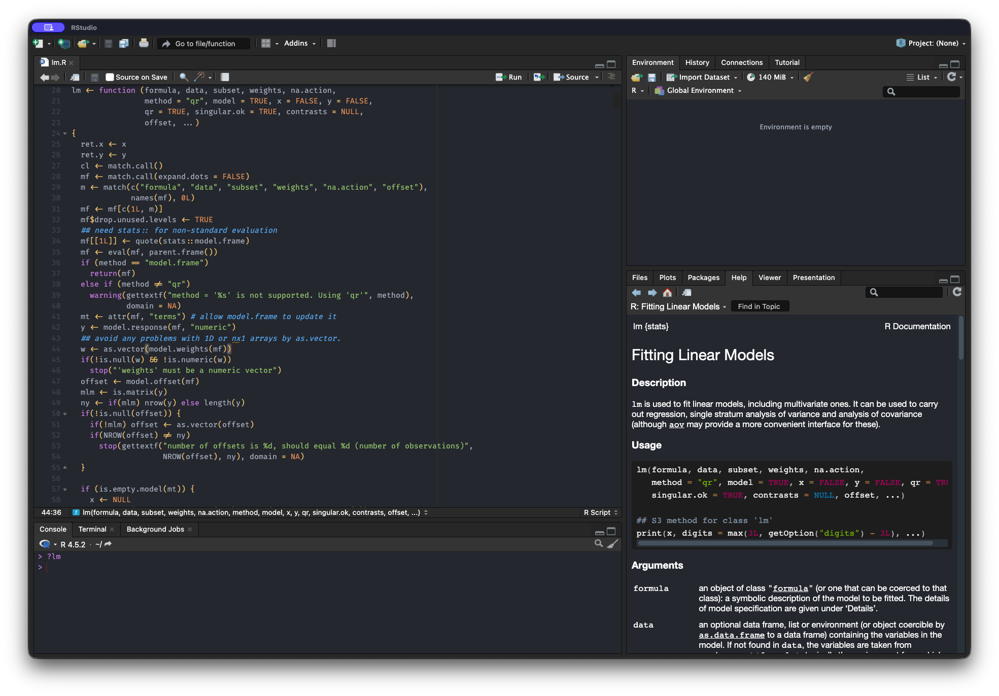
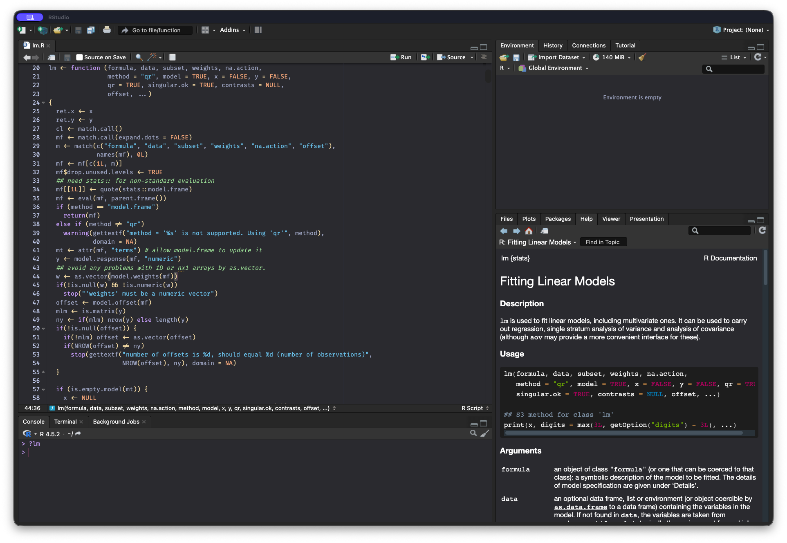

### RStudio Theme Inspired by Atom's One Dark



### RStudio Theme Inspired by Catppuccin Mocha 



### Add Theme

**On MacOS** run the following in R:

```{r}
repo <- "https://github.com/dyavorsky/my-rstudio-themes/blob/main/"
url <- paste0(repo, "atom_inspired", ".rstheme")
url <- paste0(repo, "catppuccin-mocha_inspired", ".rstheme")

rstudioapi::addTheme(url, apply = TRUE, force = TRUE)
```

This will appear in *Tools \> Global Options \> Appearance \> Editor Theme* as **One Dark {DY}** or **Catppuccin-Mocha {DY}**


**On Windows** (or if you have issues applying the theme programatically on MacOS):

 - Download the *.rstheme* file from this github repo
 - Go to RStudio's Tools > Global Options > Appearance
 - Under Editor Theme, click "Add"
 - Select the *.rstheme* file from it's location on your machine
 - Click "Apply"

### Remove Theme

To remove this theme, go to RStudio's *Tools > Global Options > Appearance* and click "Remove" or simply run

```{r}
rstudioapi::removeTheme("One Dark {DY}")
```

### Resources

More information on custom RStudio themes can be found here:

- Posit's article "Using Themes in the RStudio IDE" [[link](https://support.posit.co/hc/en-us/articles/115011846747-Using-Themes-in-the-RStudio-IDE)]
- RStudio Extensions website for "Creating Custom Themes for RStudio" [[link](https://rstudio.github.io/rstudio-extensions/rstudio-theme-creation.html)]
- tkrable's GitHub repo for One Dark [[link](https://github.com/tkrabel/rstudio_atom_theme)]
- The official Catppuccin website [[link](https://catppuccin.com/palette/)]


If you like the dark RStudio theme (not the editor theme), check out **darkstudio** [[link](https://github.com/rileytwo/darkstudio)]
